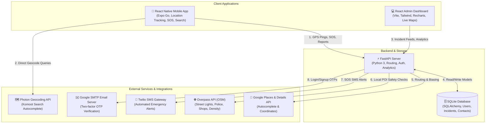
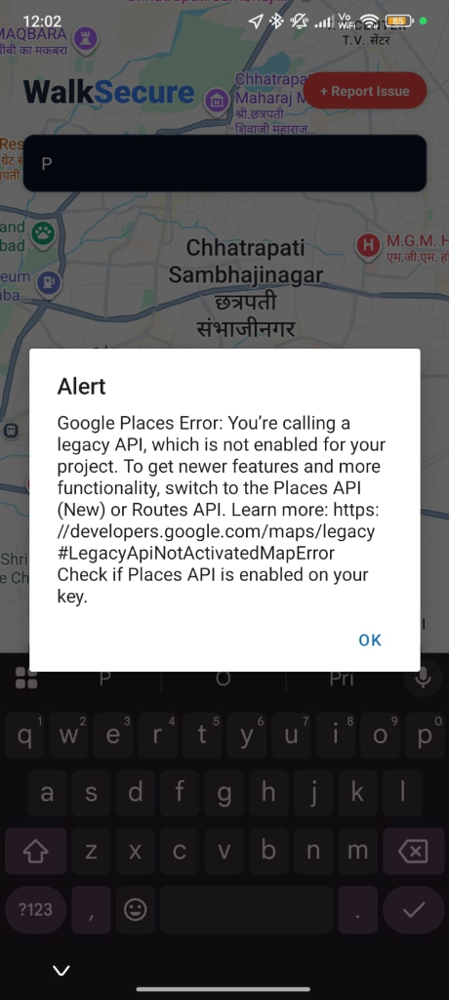
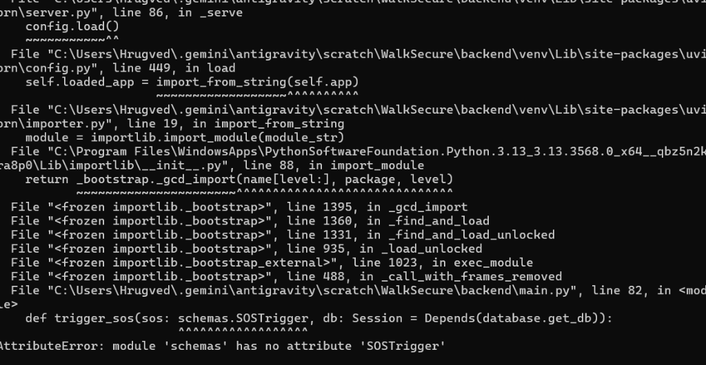
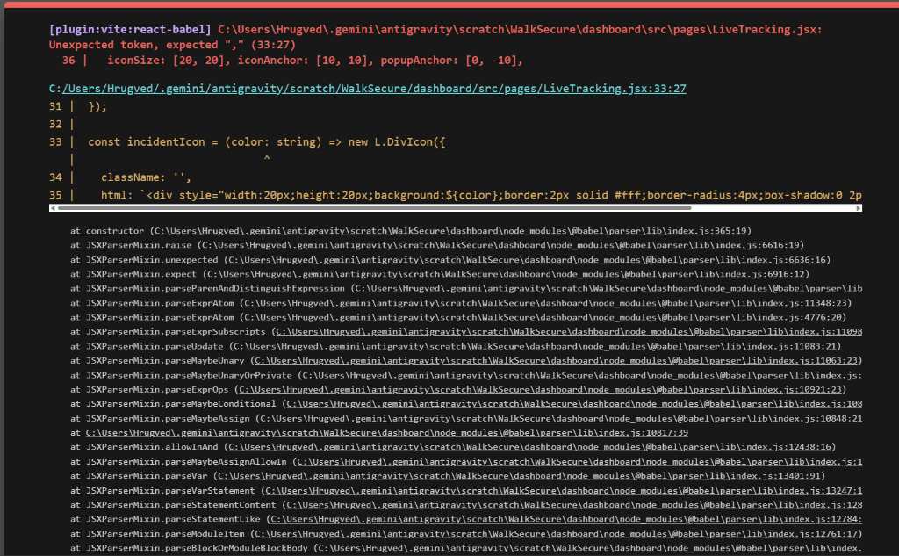
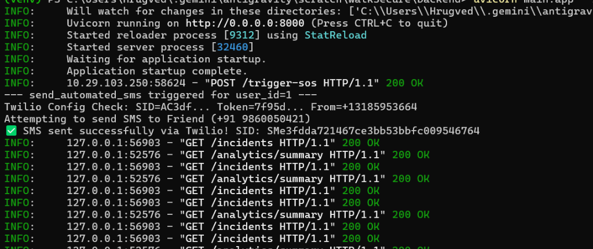
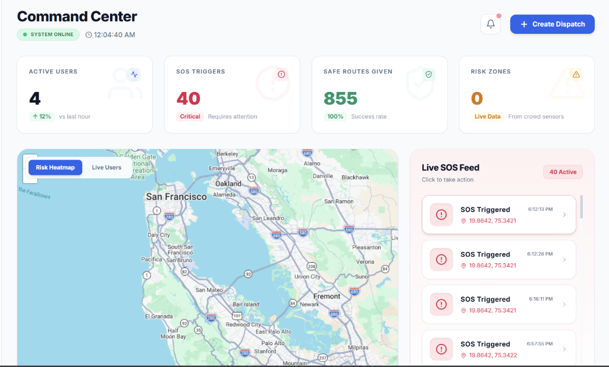
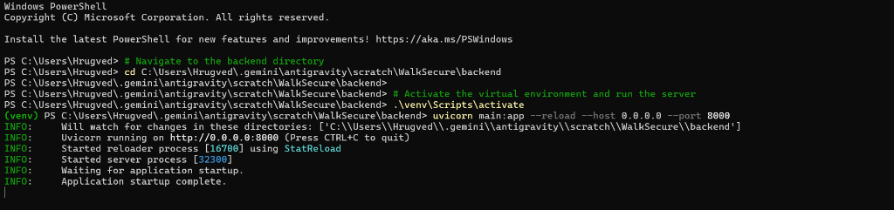

# 🛡️ WalkSecure
> **Real-Time Safety Navigation, Automated SOS, and Incident Intelligence Platform**

WalkSecure is a production-ready personal safety tracking and routing ecosystem designed to keep pedestrians safe. The system consists of an **Expo Mobile App** for users, a **Vite + React Admin Dashboard** for monitoring staff, and a **FastAPI Python Backend** with automated emergency integrations (SMS/Email) and ML-powered safety route calculations.

---

## 🏗️ System Architecture

The following diagram illustrates the data flow and system integrations between the Mobile Client, Web Dashboard, Python Backend, Database, and external APIs.



---

## 🛠️ Technology Stack

| Component | Technology | Key Libraries / Frameworks |
| :--- | :--- | :--- |
| **Backend API** | Python 3.10+ | FastAPI, Uvicorn, SQLAlchemy, Twilio SDK, Pydantic |
| **Admin Dashboard** | React 18 / Vite | Tailwind CSS, Leaflet Maps, Recharts, Lucide Icons, Axios |
| **Mobile Client** | React Native / Expo | Expo Router, Expo Location, Expo SMS, AsyncStorage, Leaflet/Maps |
| **Database** | SQL | SQLite (Development), SQLAlchemy ORM |
| **Map & Geocoding** | Geospatial APIs | OpenStreetMap (Overpass), Photon, Google Places Autocomplete & Details |

---

## ✨ Features

### 📱 1. Mobile App Features
- **Pulsing Animated Splash Screen:** Smooth ring-pulse animations transitioning automatically to auth or dashboard view.
- **Biased Search Autocomplete:** Real-time search-as-you-type geocoding with local biasing, powered by **Google Places API** (proxied securely through the backend) with a seamless fallback to the **Photon Geocoding API**.
- **Automated SOS Alerts:** One-click emergency trigger that immediately dispatches automated SMS (via Twilio) and verification Emails (via SMTP App passwords) containing live tracking Google Maps links to all registered emergency contacts.
- **Safety route calculations:** Custom route calculation using OSRM, enhanced with street lighting coverage, commercial business density, and local police presence scores.
- **Detailed Incident Reporter:** Dedicated custom reporting screen with category chips (theft, harassment, poor lighting, hazard), risk levels, and descriptions.

### 💻 2. Admin Dashboard Features
- **Full-Screen Live Tracking Map:** Renders real user tracking paths, pulsing active SOS locations, and circle heatmaps of local risk zones.
- **AI Analytics & Intelligence Dashboard:** 6 interactive chart types (Recharts) detailing incident frequencies by hour, trends, safety indices, and localized high-risk tables.
- **Incident Monitoring Board:** Live-polling tabular incident feed with filtering options, slide-in details sheets, and one-click "Resolve" actions.
- **Auth Guard & Admin Management:** Role-based staff invitation, editing, and super-admin controls.

---

## 🔧 Installation & Setup

### Prerequisites
- [Node.js](https://nodejs.org/) (v18+)
- [Python](https://www.python.org/) (v3.10+)
- [Git](https://git-scm.com/)

---

### 1. Setup Backend
1. Navigate to the backend directory:
   ```bash
   cd backend
   ```
2. Create and activate a Python virtual environment:
   ```bash
   # Windows
   python -m venv venv
   venv\Scripts\activate

   # macOS/Linux
   python3 -m venv venv
   source venv/bin/activate
   ```
3. Install dependencies:
   ```bash
   pip install -r requirements.txt
   ```
4. Create a `.env` file in the `backend/` directory and configure the environment variables:
   ```env
   DATABASE_URL=sqlite:///./walksecure.db
   GOOGLE_MAPS_API_KEY=your_google_maps_api_key_here
   SMTP_EMAIL=your_email@gmail.com
   SMTP_PASSWORD=your_gmail_app_password_here
   TWILIO_ACCOUNT_SID=your_twilio_sid_here
   TWILIO_AUTH_TOKEN=your_twilio_auth_token_here
   TWILIO_PHONE_NUMBER=your_twilio_phone_number_here
   ```
5. Run the FastAPI server:
   ```bash
   uvicorn main:app --reload --host 0.0.0.0 --port 8000
   ```

---

### 2. Setup Web Dashboard
1. Navigate to the dashboard directory:
   ```bash
   cd ../dashboard
   ```
2. Install dependencies:
   ```bash
   npm install
   ```
3. Run the development server:
   ```bash
   npm run dev -- --host 0.0.0.0
   ```
4. Open your browser and navigate to `http://localhost:5173`.
   - **Default Admin Account:** `admin@walksecure.in`
   - **Password:** `WalkSecure@2024`

---

### 3. Setup Mobile App
1. Navigate to the mobile directory:
   ```bash
   cd ../mobile
   ```
2. Install dependencies:
   ```bash
   npm install
   ```
3. Start the Expo server:
   ```bash
   npx expo start
   ```
4. Scan the QR code using the **Expo Go app** on your iOS or Android device.

---

## 📸 Screenshots & Previews

Here are some interface previews showing the components in action:

### 📱 Mobile App Overview
| App Search & Routes | Live Safety Insights | Dedicated Incident Reporting |
| :---: | :---: | :---: |
|  |  |  |

---

### 💻 Web Admin Dashboard
#### 🗺️ Real-time Tracking & Active SOS Monitoring


#### 📊 AI Analytics Dashboard


#### 📋 Incident Incident Log


---

## 🎥 Demo Video

You can watch the full workflow, including:
1. Triggering an SOS from the mobile device.
2. The instant SMS notification dispatch.
3. The dashboard live map picking up the pulsing marker and displaying user coordinates.
4. Marking the incident as resolved to clear the feed.

> 🎬 *Demo clip path / walkthrough notes: [walkthrough.md](./walkthrough.md)*
